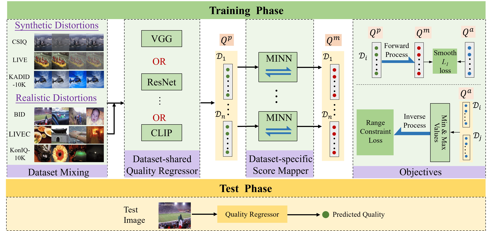

# MIMI
Code for "Monotonic and Invertible Network: A General Framework for Learning IQA Model from Mixed Datasets"


# Environment

The code has been tested on Linux systems with python 3.8. Please refer to requirements.txt for installing dependent packages.
```
pip install -r requirements.txt
```

# Running

## Data Preparation

Before running the project, you need to prepare the necessary datasets. Please follow these steps:

1. **Download Datasets**: Obtain the following six dataset folders:
    - [databaserelease2](https://live.ece.utexas.edu/research/quality/subjective.htm)
    - CSIQ
    - [BID](https://github.com/zwx8981/UNIQUE)
    - [ChallengeDB_release](https://live.ece.utexas.edu/research/ChallengeDB/)
    - [koniq-10k](https://database.mmsp-kn.de/)
    - [kadid10k](https://database.mmsp-kn.de/kadid-10k-database.html)

2. **Place Datasets in Project Directory**: Place the downloaded dataset folders into the root directory of this project. The expected directory structure should look like this:

    ```
    MIMI/
    ├── fig/
    │   └── Framework.png
    ├── MIMI-CLIP/
    ├── MIMI-VGG&ResNet/
    ├── Re-annotated-dataset/
    ├── databaserelease2/
    ├── CSIQ/
    ├── BID/
    ├── ChallengeDB_release/
    ├── koniq-10k/
    ├── kadid10k/
    ├── LICENSE
    ├── README.md
    └── requirements.txt
    ```

## Training & Evaluation

### 1. Model Training on 10 Splits

Below are the commands to train the different variants of the **MIMI** models using 10 data splits.

#### MIMI-CLIP
```bash
cd MIMI-CLIP
python train.py
```

#### MIMI-ResNet
```bash
cd MIMI-VGG&ResNet
python Main.py --backbone resnet34 --batch_size 32
```

#### MIMI-VGG
```bash
cd MIMI-VGG&ResNet
python Main.py --backbone vgg16 --batch_size 16
```

### 2. Model Evaluation on Test Sets

Once training is complete, evaluate each model variant on the test sets as described below.

#### MIMI-CLIP
```bash
cd MIMI-CLIP
python BIQA_benchmark.py
```

#### MIMI-ResNet
```bash
cd MIMI-VGG&ResNet
python Main.py --backbone resnet34 --train False --get_scores True
```
> After running the above command, open **`calculate_mean.m`** in **MATLAB** to compute the weighted **SRCC** and **PLCC** scores.

#### MIMI-VGG
```bash
cd MIMI-VGG&ResNet
python Main.py --backbone vgg16 --train False --get_scores True
```
> Similarly, run **`calculate_mean.m`** in **MATLAB** afterward to obtain the final performance metrics.

# Unified Perception Image Quality Assessment Dataset

## Overview
To validate the effectiveness of score alignment, we re-annotated representative image sets from six IQA datasets **under a unified perceptual standard**. Specifically, we **uniformly** sampled 100 images from each dataset's test set and 100 from its training set (200 images per dataset). Subjective experiments were conducted following the `ITU-R BT.500-13` standard, involving 16 subjects, yielding 19,200 quality ratings. By offering a unified perceptual annotation framework, this dataset aims to bridge the gap across heterogeneous IQA sources and foster the design of more generalizable mixed-dataset learning models in future IQA research.

## Subjective Test Results
```
Re-annotated-dataset/
├── name_mos_test.txt       
└── name_mos_train.txt  
```
Each file contains lines in the format:

```
<image_filename> <MOS_score>
```

Where:
- `<image_filename>` is a combination of the dataset name and relative image path.

# Pre-trained weights
We provide pre-trained model checkpoints that were trained on the full set of mixed datasets.

🔗 **Download Link (Baidu Pan):**  
[https://pan.baidu.com/s/1D-eeSMfZruaqr9gRtDxqbQ](https://pan.baidu.com/s/1D-eeSMfZruaqr9gRtDxqbQ)  
*(Password: g4qw)*

# Acknowledgements

This project is built upon the codebases of [LIQE](https://github.com/zwx8981/LIQE) and [UNIQUE](https://github.com/zwx8981/UNIQUE). We thank the authors for their open-sourced implementations.